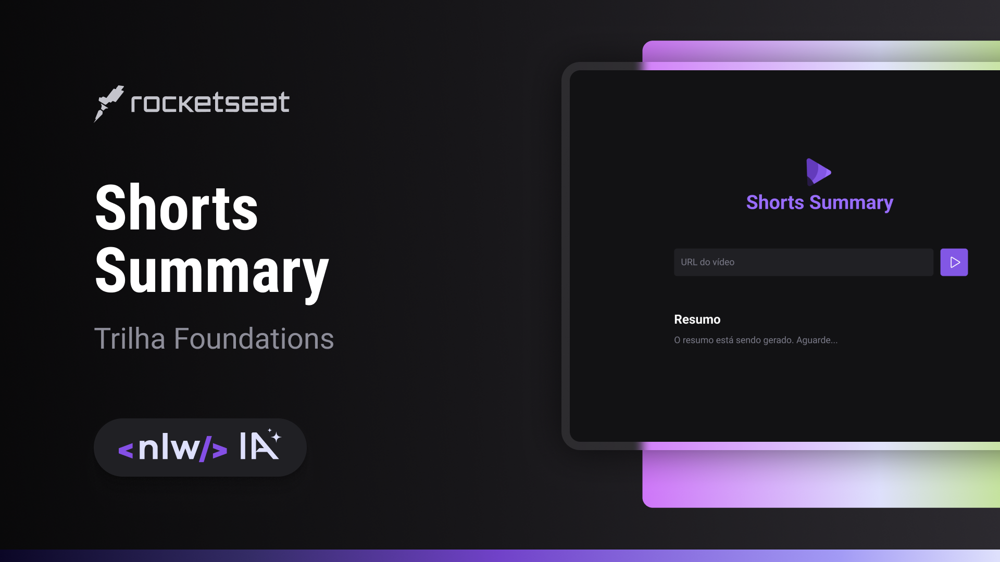

<br />
<div align="center">
  <a href="#">
    
  </a>

  <h3 align="center">Shorts Summary</h3>

  <p align="center">
    Transcreva e resuma Shorts com Inteligência Artificial! 🚀
    <br />
    </div>

<div align="center">


</div>

<h4 align="center"> 
	✅  Aplicação finalizada ✅
</h4>

<details>
  <summary>Sumário</summary>
  <ol>
    <li>
      <a href="#💻-sobre-o-projeto">Sobre o projeto</a>
    </li>
    <li>
      <a href="#🔍-preview">Preview</a>
    </li>
    <li>
      <a href="#⚙️-rodando-localmente">Rodando localmente</a>
        <li><a href="#🛠-tecnologias-utilizadas">Tecnologias utilizadas</a></li>
    </li>
    <li><a href="#🎨-layout">Layout</a></li>
    <li><a href="#✒️-autor">Autor</a></li>
    <li><a href="#📝-licença">Licença</a></li>
    <li><a href="#💜-agradecimentos">Agradecimentos</a></li>
  </ol>
</details>

## 🔍 Preview



## 💻 Sobre o projeto

<p>Shorts Summary é uma aplicação web para criar resumo de vídeos shorts do Youtube utilizando Inteligência Artificial para transcrever o conteúdo do vídeo e realizar o resumo do conteúdo. Esse projeto foi desenvolvido na trilha Foundations na edição <strong>NLW IA</strong>.
</p>

## ⚙️ Rodando localmente

### Pré-requisitos

```
# Clone o repositório
$ git clone <https://github.com/lilo-afk/NLW-IA.git>

# Acesse a pasta do projeto no terminal/cmd
$ cd NLW-IA

# Instale as dependências
$ npm i

# Execute a aplicação

$ npm run web
$ npm run server

# O Frontend da aplicação iniciará porta:5173 - acesse <http://localhost:5173>

# O servidor inciará na porta:3333 - acesse <http://localhost:3333>
```

## 🛠 Tecnologias utilizadas


## 🎨 Layout

O layout da aplicação está disponível no Figma:

<a href="https://www.figma.com/community/file/1282823495335498952/shorts-summary-trilha-foundations" >
</a>

## ✒️ Autor


<a href="https://github.com/lilo-afk" ><sub><b>Lilo-afk</b></sub></a> <a title="Fino señores">🍷</a>

Feito com ❤️ por Murilo Martins Alves 👋🏽 Entre em contato!

[](https://www.linkedin.com/in/victor-silva-9485021b2/)
[](mailto:mma.murilo@gmail.com)

---

## 📝 Licença

Este projeto está sobe a licença [MIT](./LICENSE). Consulte `LICENSE` para mais informações.

## 💜 Agradecimentos

Meus profundos agradecimentos pela oportunidade e realização do projeto a <a href="https://github.com/rocketseat-education" >RocketseatEducation.</a>
